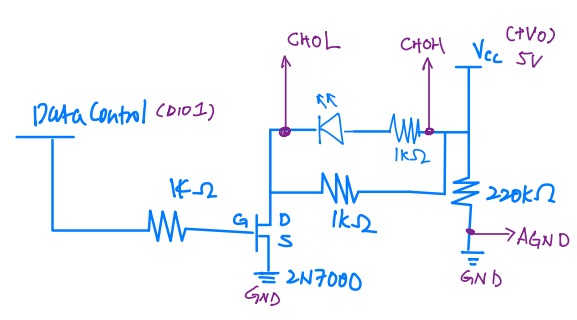

# MOSFET Logger Readme

This folder contains scripts related to MOSFET logging using the MCC ULW library.

## Files

### sim_digital_out.py

This file implements digital output using a basic MOSFET circuit.

### sim_toggle_data_read.py

This file uses CH0H and CH0L channel for data exploration.
AGND is added too.

### sim_toggle_timer_read.py

This file includes a timer function built on top of sim_toggle_data_read.
Replace DIO1 with TMR0

**Remarks:**

- blue line: Basic circuit for sim_digital_out.py
- purple line: with CH0H and CH0L differential mode modified circuit for sim_toggle_data_read.py
- DIO1 to TMR0: circuit for sim_toggle_timer_read.py